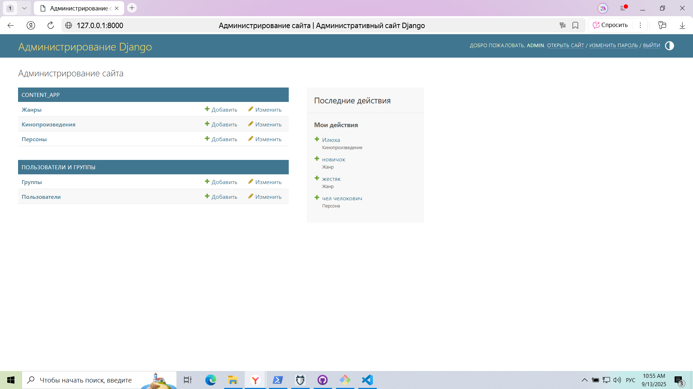

# Проектное задание: SQL

Результатом вашей работы в этом спринте должен стать DDL-файл с описанием базы данных. Заполнять базу или описывать в репозитории скрипты для её заполнения не нужно.

Критерии готовности:

- В репозитории есть DDL-файл с перечнем SQL-запросов, необходимых для создания базы с нуля.
- Таблицы и названия полей соответствуют схеме из первого урока.
- Созданы индексы и ограничения уникальности.
- Все таблицы находятся в схеме content.
- В качестве первичных ключей используется uuid.

# Решение
(ниже C:/course/sprint_1 - это путь где сохранен файл schema_design.sql, так что он будет у вас отличаться)

```
CREATE DATABASE movies;
\c movies
\i 'C:/course/sprint_1/schema_design.sql'

```

# Проверка решения
```
movies_database=> \dn
       List of schemas
  Name   |       Owner
---------+-------------------
 content | app
 public  | pg_database_owner
(2 rows)


movies_database=> \dt content.*
             List of relations
 Schema  |       Name       | Type  | Owner
---------+------------------+-------+-------
 content | film_work        | table | app
 content | genre            | table | app
 content | genre_film_work  | table | app
 content | person           | table | app
 content | person_film_work | table | app
(5 rows)


movies_database=> \d content.film_work
                         Table "content.film_work"
    Column     |           Type           | Collation | Nullable | Default
---------------+--------------------------+-----------+----------+---------
 film_id       | uuid                     |           | not null |
 title         | text                     |           | not null |
 description   | text                     |           |          |
 creation_date | date                     |           |          |
 rating        | double precision         |           |          |
 film_type     | text                     |           | not null |
 created_at    | timestamp with time zone |           |          | now()
 updated_at    | timestamp with time zone |           |          | now()
Indexes:
    "film_work_pkey" PRIMARY KEY, btree (film_id)
    "idx_film_work_title" btree (title)
Check constraints:
    "film_work_rating_check" CHECK (rating >= 0::double precision AND rating <= 10::double precision)Referenced by:
    TABLE "content.genre_film_work" CONSTRAINT "genre_film_work_film_work_id_fkey" FOREIGN KEY (film_work_id) REFERENCES content.film_work(film_id) ON DELETE CASCADE
    TABLE "content.person_film_work" CONSTRAINT "person_film_work_film_work_id_fkey" FOREIGN KEY (film_work_id) REFERENCES content.film_work(film_id) ON DELETE CASCADE
```


# Проектное задание: панель администратора

Вам необходимо разработать сервис, который позволит создавать и редактировать записи в базе данных.

Критерии готовности:

- Интерфейс панели администратора настроен стандартными средствами Django.
- В нём можно создавать, редактировать и удалять кинопроизведения, жанры и персон.
- Связи между кинопроизведениями, жанрами и персонами заводятся на странице редактирования кинопроизведения.
- Вы используете базу данных, созданную на прошлом этапе.
- Системные таблицы Django не используют схему content.
- У вас описана initial-миграция, которая создаёт те же структуры, что и SQL из первого задания.
- Таблицы описаны в файле models.py.
- `settings.py` разбит на логические модули
- Поля created и modified проставляются автоматически.
- Чувствительные данные берутся из переменных окружения
- Все тексты переведены на русский с помощью `gettext_lazy`

# Решение (тезисно)

1️⃣ Проект и приложение

Django-проект movies_admin.

Приложение content_app для фильмов, жанров и персон.

Виртуальное окружение используется для изоляции зависимостей.

2️⃣ База данных

Используется PostgreSQL, база movies.

Все пользовательские таблицы находятся в схеме content.

Системные таблицы Django (auth, admin) остаются в public.

Настройки базы в settings/dev.py через dj_database_url.

3️⃣ Модели (models.py)

FilmWork: uuid, title, description, creation_date, rating, film_type, created_at, updated_at.

Genre: uuid, name (unique), description, created_at, updated_at.

Person: uuid, full_name, created_at, updated_at.

Связи через промежуточные таблицы:

GenreFilmWork (film ↔ genre)

PersonFilmWork (film ↔ person + role)

created_at и updated_at автоматически заполняются (auto_now_add / auto_now).

Все поля и модели используют gettext_lazy для русификации.

4️⃣ Админка Django

Стандартная панель администратора (admin.site.register) для всех моделей.

Связи создаются через встроенный интерфейс (InlineModelAdmin для ManyToMany).

Можно создавать, редактировать и удалять фильмы, жанры и персон.

5️⃣ Миграции

Описана initial миграция, полностью соответствующая структуре из первого задания.

Миграции создают все таблицы в схеме content.

Применение миграций через python manage.py migrate.

6️⃣ Безопасность и конфигурация

Пароли и чувствительные данные берутся из переменных окружения.

settings.py разбит на модули: base / dev / prod.

Как выглядит админка



# Проектное задание: перенос данных

Вооружитесь библиотеками psycopg и sqlite3, чтобы создать скрипт для миграции данных в новую базу.

Критерии готовности:

- После применения скрипта все фильмы, персоны и жанры появляются в PostgreSQL.  
- Все связи между записями сохранены. 
- В коде используются `dataclass`.
- Данные загружаются пачками по n записей.
- Повторный запуск скрипта не создаёт дублирующиеся записи.
- В коде есть обработка ошибок записи и чтения.

# Решение

1. Создать SQLite базу с тестовыми данными:

```
python sqlite_to_postgres/init_sqlite.py
```

2. Перенести данные в PostgreSQL:

```
python sqlite_to_postgres/load_data.py
```
3. Настройка PostgreSQL:
```
CREATE USER app WITH PASSWORD '123qwe';
CREATE DATABASE movies_database OWNER app;
```

4. Проверка таблиц и схемы:

```
\c movies_database
\dn
\dt content.*
```

5. Проверка количества записей:
```
SELECT COUNT(*) FROM content.film_work;
SELECT COUNT(*) FROM content.genre;
SELECT COUNT(*) FROM content.person;
SELECT COUNT(*) FROM content.genre_film_work;
SELECT COUNT(*) FROM content.person_film_work;
```